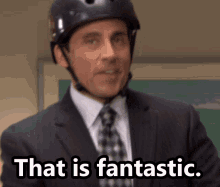

<!-- Liquid:  statements -->

<!-- Include submenu from _includes to top of pages -->

<!--- Concatenation of site URL to frontmatter image  --->



<!--- Has is a list variable containing mario metadata for sprite --->



<!--- Size width/height of Sprit images --->



<!--- HTML for page contains 
 tag named "Mario" and class properties for a "sprite"  -->

  
<!--- Embedded Cascading Style Sheet (CSS) rules, 
        define how HTML elements look 
--->

<!--- Embedded executable code--->

# Home

[**BRAINROT**](skibidbiden)

**MY FIRST DAYS PAGE IS ON THE BUTTONS**

## Nolan's Notes

1. I didn't do all the hacks in order, so the links to them are scattered around.
2. I imported my own theme from another Jekyll website (andrewhwanpark/dark-poole) and made changes to certain things, including the footer and navbar GIFs.
3. Please don't judge my photography since I just imported all my photos from Lightroom.

## HTML Hacks (Image + Table\[submenu\])

| [Javascript Cell](posts/js) | [About](about) | [Python Hacks](posts/py-hacks) | [Attempted vs Accomplishment](posts/what) |

## (Some) Javascript Hacks

* [ITunes API + JS/HTML Output](posts/itunes)
* [Calculator](calculator)

I put my Javascript cell (my person object) in the table below.

  <button style='color:white;' onclick="swapTheStuff()">swap the links</button>

<button id="btn1"><a href="firstdays/">first days</a></button>
 
<button id="btn2"><a href="about/">about</a></button>

As for if getting Google Snake is considered being lazy, I would like to note that Google has the site disabled for IFrame so I couldn't just add it to my site. I instead got the code and added it to a new folder called games/ and added a game.html (expansion wip, this means u can choose dif games based on way of import) so I can add it to any site I want. I also made it so using the arrow keys doesn't move the site up in down by comminicating to the parent site with JS and eventListeners.

This took probably more problem solving and critical thinking that just copying the snake code that you provided, but idk 🤷



### Mr Brown Clicker

   
   
Score: Click to start!

