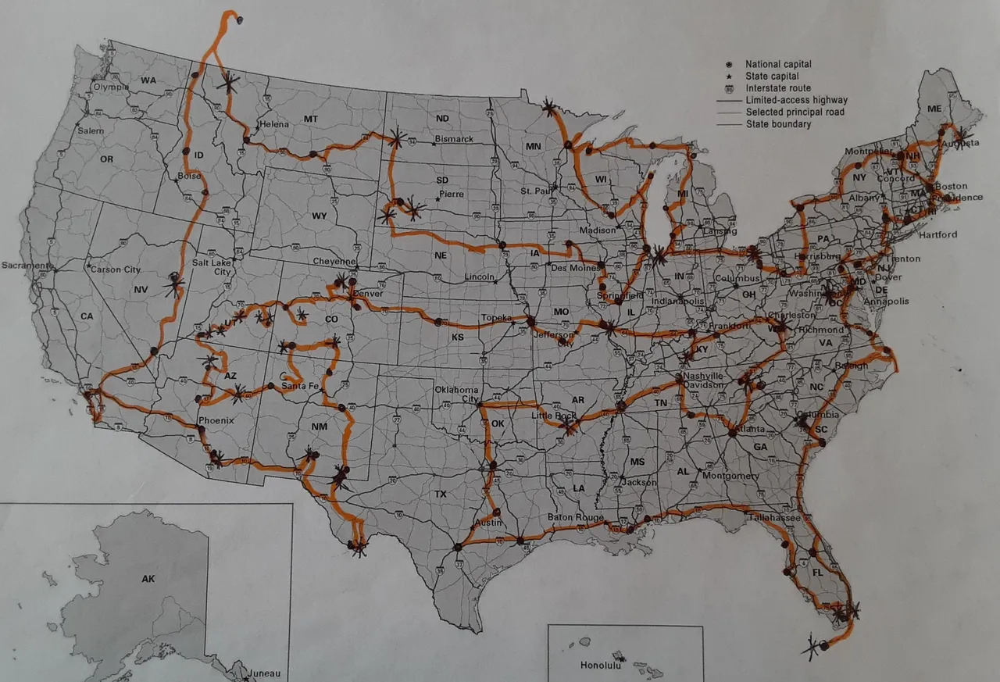

**Nolan (kinda) knows how to code.**

- Born: December 2008, San Diego
- Lives in: 4S Ranch, San Diego

Interests:

- NodeJS
- Running (XC & Track)
- APIs & Problem Solving

Cool things I've done:

- I've gone on a road trip for a year around the US (I've been to all the states except Alaska)
- I made a Duolingo API wrapper (for NodeJS 💪)

Things I have yet to do:

- Figure out the theme switcher for Jekyll
- Figure out Jeykyll

**MAP OF MY YEAR LONG TRIP:**

